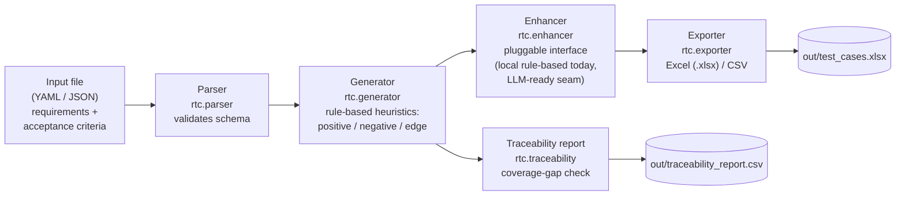

# Requirements-to-Test-Cases

A small, offline Python toolkit that helps Business Analysts and QA teams
turn structured requirements (user stories + acceptance criteria) into
draft QA test-case scaffolding — with full traceability back to the
originating requirement.

> **Disclaimer:** This is an independently written, representative
> portfolio project built entirely with synthetic data. It does not
> contain, reproduce, or reference any employer's proprietary code, data,
> or systems.

---

## 1. Business problem

Business Analysts routinely translate user stories and acceptance criteria
into test cases so that QA can validate a feature before release. In
practice this step is:

- **Repetitive** — the same Given/When/Then pattern gets manually re-typed
  into a test case template dozens of times per sprint.
- **Error-prone** — it is easy to forget the "negative" or "edge" case for
  a rule like *"the field is required"* or *"the amount must be at least
  X and at most Y"* when writing test cases by hand under time pressure.
- **Hard to audit** — reviewers often ask, "which requirements don't have
  test coverage yet?" and answering that requires manually cross-referencing
  a requirements doc against a test case spreadsheet.

**Requirements-to-Test-Cases** addresses this by parsing a structured
requirements file and automatically drafting a first pass of test cases —
one positive-path case per acceptance criterion, plus rule-based
negative/edge cases triggered by common keywords ("required", "at least",
"maximum", "unique", "valid"). A human QA engineer or BA then reviews and
refines the drafts rather than starting from a blank page. The tool also
produces a traceability report that flags any requirement with **zero**
generated test cases, so coverage gaps surface automatically during review.

This is a **draft-generation aid**, not a replacement for human test
design judgment — see [Limitations](#7-limitations--future-enhancements).

---

## 2. Architecture



Text-only equivalent, for renderers without Mermaid support:

```
+-------------+     +----------+     +-----------+     +-----------+     +-----------+
| Input file  | --> | Parser   | --> | Generator | --> | Enhancer  | --> | Exporter  | --> out/test_cases.xlsx
| YAML / JSON |     | rtc.     |     | rtc.      |     | rtc.      |     | rtc.      |
+-------------+     | parser   |     | generator |     | enhancer  |     | exporter  |
                     +----------+     +-----+-----+     +-----------+     +-----------+
                                            |
                                            v
                                   +-------------------+
                                   | Traceability report|  --> out/traceability_report.csv
                                   | rtc.traceability    |
                                   +-------------------+
```

### Module responsibilities

| Module | Responsibility |
|---|---|
| `rtc.models` | Plain dataclasses: `Requirement`, `AcceptanceCriterion`, `TestCase` |
| `rtc.parser` | Load + validate a YAML/JSON requirements file |
| `rtc.generator` | Rule-based generation of positive/negative/edge test cases |
| `rtc.enhancer` | Abstract `TestCaseEnhancer` interface + offline `RuleBasedEnhancer` (LLM plug-in point) |
| `rtc.exporter` | Write test cases to `.xlsx` (openpyxl) or `.csv` |
| `rtc.traceability` | Build & export the requirement -> test-case coverage report |
| `rtc.cli` | `argparse`-based command line interface |

---

## 3. Tech stack

- **Python** 3.9+
- **PyYAML** — requirements file parsing
- **openpyxl** — Excel export
- **pytest** — test suite
- Standard library: `argparse`, `logging`, `csv`, `dataclasses`, `enum`, `abc`

No database, no web framework, no external network calls — this runs
entirely on your local machine.

---

## 4. Installation

```bash
# 1. Clone the repository, then from its root:
python3 -m venv .venv
source .venv/bin/activate          # on Windows: .venv\Scripts\activate

# 2. Install dependencies
pip install -r requirements.txt

# 3. Install this package in editable mode (enables `python -m rtc` and the `rtc` console script)
pip install -e .
```

---

## 5. Usage

### 5.1 Generate test cases from the bundled sample

```bash
python -m rtc generate \
  --input examples/sample_requirements.yaml \
  --output out/test_cases.xlsx \
  --report out/traceability_report.csv
```

### 5.2 Actual captured output

```
2026-09-21 17:51:24,839 | INFO     | rtc.parser | Loaded 5 requirement(s) from examples/sample_requirements.yaml
2026-09-21 17:51:24,840 | INFO     | rtc.generator | Generated 19 total test case(s) across 5 requirement(s)
2026-09-21 17:51:24,848 | INFO     | rtc.exporter | Exported 19 test case(s) to out/test_cases.xlsx
2026-09-21 17:51:24,848 | INFO     | rtc.traceability | All requirements have at least one generated test case

Generated 19 test case(s) from 5 requirement(s).
Test cases written to: out/test_cases.xlsx

Traceability / coverage summary:
Requirement  Title                             AC#  TestCases  Pos  Neg  Edge  Status
-----------  --------------------------------  ---  ---------  ---  ---  ----  ------
REQ-001      Applicant email address capture   3    6          3    3    0     OK    
REQ-002      Requested loan amount validation  2    5          2    1    2     OK    
REQ-003      Annual income disclosure          1    3          1    2    0     OK    
REQ-004      Applicant identity document uplo  1    2          1    0    1     OK    
REQ-005      Application submission confirmat  1    3          1    2    0     OK    

Traceability report written to: out/traceability_report.csv
```

### 5.3 Sample generated test cases (from `out/test_cases.xlsx`)

| test_case_id | source_requirement_id | type | title | expected_result (truncated) |
|---|---|---|---|---|
| TC-REQ-001-AC1-POS | REQ-001 | positive | Verify: they enter a valid email address and submit | The system confirms that the application record is created... |
| TC-REQ-001-AC1-NEG-INV | REQ-001 | negative | Verify rejection of invalid input (Applicant email address capture) | The system rejects the invalid input and displays a clear validation error... |
| TC-REQ-001-AC2-NEG-REQ | REQ-001 | negative | Verify error when required data is missing (Applicant email address capture) | The system blocks the action and displays a validation error indicating... |
| TC-REQ-002-AC1-EDGE-MIN | REQ-002 | edge | Verify boundary just below the minimum (Requested loan amount validation) | The system rejects the value and displays a message stating the minimum... |
| TC-REQ-002-AC1-EDGE-MAX | REQ-002 | edge | Verify boundary just above the maximum (Requested loan amount validation) | The system rejects the value and displays a message stating the maximum... |

Full exported columns: `test_case_id, source_requirement_id, type, title, preconditions, steps, expected_result`.
The `steps` column flattens the ordered step list into one numbered, pipe-delimited cell (e.g. `1. ... | 2. ... | 3. ...`) since flat spreadsheet cells cannot hold nested lists.

### 5.4 CLI options

```
usage: rtc generate [-h] --input INPUT --output OUTPUT [--report REPORT]
                     [--enhancer {rule-based,none}]
                     [--log-level {DEBUG,INFO,WARNING,ERROR,CRITICAL}]

  --input      Path to a YAML or JSON requirements file
  --output     Output path; .xlsx or .csv extension selects the format
  --report     Optional path to also write a traceability/coverage CSV
  --enhancer   'rule-based' (default, tidies wording) or 'none' (raw draft)
  --log-level  Logging verbosity (default: INFO)
```

### 5.5 Using it as a library

```python
from rtc.parser import load_requirements
from rtc.generator import TestCaseGenerator
from rtc.enhancer import RuleBasedEnhancer
from rtc.exporter import export_test_cases

requirements = load_requirements("examples/sample_requirements.yaml")
test_cases = TestCaseGenerator().generate(requirements)

enhancer = RuleBasedEnhancer()
enhanced = [enhancer.enhance(tc, req_by_id[tc.source_requirement_id]) for tc in test_cases]

export_test_cases(enhanced, "out/test_cases.xlsx")
```

### 5.6 Docker

```bash
docker build -t rtc .
docker run --rm -v "$(pwd)/out:/app/out" rtc \
  generate --input examples/sample_requirements.yaml --output out/test_cases.xlsx
```

---

## 6. The pluggable enhancer / LLM integration point

`rtc.enhancer.TestCaseEnhancer` is an abstract base class with one method,
`enhance(test_case, requirement) -> test_case`. This repository ships one
concrete implementation, `RuleBasedEnhancer`, which runs **fully offline**
(whitespace/capitalization cleanup + a small sample-data lookup table) —
no API key, no network call, nothing to configure.

In a real deployment, a team could add a second implementation that calls
an LLM (ChatGPT, GitHub Copilot's API, an internal model gateway, etc.) to
rewrite test case wording more fluently, propose realistic sample data, or
suggest additional edge cases the keyword rules missed. See the
docstring at the top of `rtc/enhancer.py` for a sketch of what that
subclass would look like and how it would read its API key from an
environment variable (`config/.env.example` documents the expected
variable names) — this pattern is documented, but **no such network-calling
code is included or executed** in this project.

---

## 7. Limitations & future enhancements

**Current limitations:**
- Heuristics are keyword-based, not semantic — an acceptance criterion
  that says "required" in an unrelated sense will still trigger a
  "missing required field" test case draft that a human should verify.
- The Given/When/Then parser is a simple regex; criteria that don't loosely
  follow that structure still generate a test case, but with a generic
  precondition.
- Every draft test case is a *starting point*, not a QA-ready artifact —
  it is expected to be reviewed and edited by a human.
- No persistence layer; each run is stateless (input file in, files out).

**Future enhancements:**
- Wire in a real LLM-backed `TestCaseEnhancer` (see Section 6).
- Support Jira/Azure DevOps import as an alternative input source.
- Detect and flag likely-duplicate test cases across requirements.
- Add a `--format markdown` export for pasting directly into a wiki/PR.
- Track test execution status over time (currently out of scope; this tool
  only drafts test cases, it does not run them).

---

## 8. Security considerations

- **No external network calls.** Parsing, generation, enhancement, and
  export all happen locally; nothing in this codebase makes an HTTP
  request.
- **No secrets required to run this project.** `config/.env.example`
  documents the environment-variable pattern a *future* real LLM
  integration would use (`LLM_API_KEY`, `LLM_MODEL`, `LLM_API_BASE_URL`)
  — copy it to `.env` (already git-ignored) only if you implement such an
  integration, and never commit a real key to source control.
- **No PII.** `examples/sample_requirements.yaml` uses entirely fictional
  field names and scenarios; no real customer data is included anywhere in
  this repository.
- Input files are validated before use; malformed YAML/JSON or missing
  required fields raise a specific exception (see `rtc.exceptions`) rather
  than failing silently or executing untrusted content.

---

## 9. Running the tests

```bash
pytest -v
```

29 tests cover the parser (valid input, malformed YAML/JSON, missing
fields, unsupported extensions), the generator (keyword heuristics, ID
uniqueness, traceability of `source_requirement_id`), the enhancer, the
exporter (Excel + CSV round trips), the traceability report, and a full
CLI end-to-end run against the bundled sample file.

---

## 10. Project structure

```
requirements-to-test-cases/
├── src/rtc/
│   ├── __init__.py
│   ├── __main__.py
│   ├── cli.py
│   ├── enhancer.py
│   ├── exceptions.py
│   ├── exporter.py
│   ├── generator.py
│   ├── logging_config.py
│   ├── models.py
│   ├── parser.py
│   └── traceability.py
├── tests/
├── examples/sample_requirements.yaml
├── config/.env.example
├── Dockerfile
├── .github/workflows/ci.yml
├── requirements.txt
├── pyproject.toml
├── LICENSE
└── README.md
```

---

## License

MIT — see [LICENSE](LICENSE).
